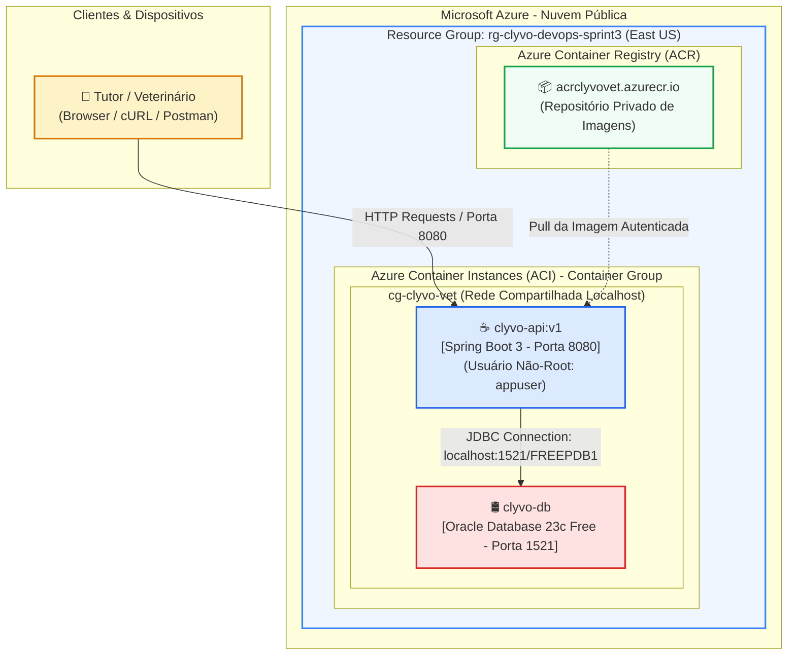

# Clyvo Vet - Enterprise Cloud Architecture & DevOps 🐾☁️
### **Entrega Oficial - 3ª Sprint: DevOps Tools & Cloud Computing (FIAP)**
**Opção Escolhida:** **Opção 1: ACR + ACI (Solução Containerizada Completa: App + Banco de Dados)**

[](https://www.oracle.com/java/)
[](https://spring.io/projects/spring-boot)
[](https://azure.microsoft.com/)
[](https://www.docker.com/)
[](https://www.oracle.com/database/)

---

## 👥 Integrantes do Grupo
- **Vitória Rodrigues Martins** - RM565160
- **Augusto Bonomo Júnior** - RM565155
- **Thomas Fontes** - RM562254
- **Gabriel Maciel** - RM562795
- **Matheus Pereira Molina** - RM563399

---

## 📖 1. Descrição da Solução
O **Clyvo Vet** é uma plataforma corporativa em nuvem desenvolvida em **Java Spring Boot 3** focada na **medicina veterinária preventiva e predição de longevidade pet**. 

A solução monitora o ciclo biológico de cães e gatos, correlacionando predisposições genéticas das raças com sinais vitais aferidos e rotina dos tutores. O sistema calcula um escore preditivo de longevidade e emite alertas precoces para mitigar patologias crônicas antes que se tornem emergências clínicas graves.

---

## 💡 2. Descrição dos Benefícios para o Negócio
A modernização da infraestrutura do Clyvo Vet com **conteinerização total (Docker), Azure Container Registry (ACR) e Azure Container Instances (ACI)** proporciona vantagens competitivas tangíveis:

1. **Alta Disponibilidade e Resiliência Serverless:** Ao utilizar contêineres gerenciados pelo Azure (ACI), eliminamos a sobrecarga de gerenciar sistemas operacionais de VMs, garantindo que o sistema de monitoramento preditivo opere 24/7.
2. **Escalabilidade Elástica sob Demanda:** A capacidade de instanciar contêineres rapidamente no ACI permite atender picos sazonais (campanhas de vacinação, surtos sazonais de ectoparasitas) sem desperdício de recursos ociosos.
3. **Imutabilidade e Segurança (Zero Admin / Non-Root):** O container da aplicação roda sob usuário estritamente sem privilégios administrativos (`USER appuser`), atendendo ao requisito de segurança 8.2 da Sprint.
4. **Governança e Entrega Ágil via IaC (Azure CLI):** 100% dos recursos são criados através de scripts idempotentes em Azure CLI, garantindo reprodutibilidade idêntica em qualquer ambiente.
5. **Persistência Confiável de Dados:** O banco de dados Oracle conteinerizado armazena com integridade referencial todo o histórico clínico e dados dos tutores e pacientes.

---

## 🗺️ 3. Desenho da Arquitetura em Nuvem (Opção 1: ACR + ACI)



---

## 🗄️ 4. Banco de Dados na Nuvem & Tabelas CORE

O banco de dados relacional oficial utilizado é o **Oracle Database 23c Free**, totalmente conteinerizado na nuvem (sem uso de H2, em conformidade com os itens 3.1 e 3.2).

O arquivo [`script_bd.sql`](script_bd.sql) isolado na raiz do projeto contém todo o DDL com chaves primárias, chaves estrangeiras e comentários detalhados nas tabelas e colunas.

### Tabelas CORE da Solução (Relacionamento 1:N)
1. **`T_TUTOR`** (Chave Primária: `cpf`): Cadastro dos tutores responsáveis pelos animais.
2. **`T_PET`** (Chave Primária: `id`, Chave Estrangeira: `tutor_cpf` referenciando `T_TUTOR`): Cadastro dos pets pacientes sob monitoramento preventivo.

---

## 🔄 5. Demonstração do CRUD CORE Completo (T_TUTOR & T_PET)

A API disponibiliza endpoints REST com documentação interativa Swagger/OpenAPI em `/swagger-ui.html`.

### Rotas Disponíveis:
| Operação | Método | Endpoint | Descrição |
| :--- | :--- | :--- | :--- |
| **CREATE** | `POST` | `/api/tutores` | Cadastra novo tutor responsável |
| **CREATE** | `POST` | `/api/pets` | Cadastra novo pet vinculado ao tutor |
| **READ** | `GET` | `/api/tutores` | Lista tutores cadastrados |
| **READ** | `GET` | `/api/pets` | Lista pets cadastrados |
| **READ** | `GET` | `/api/pets/{id}` | Busca pet por ID com HATEOAS |
| **UPDATE** | `PUT` | `/api/pets/{id}` | Atualiza biometria e status do pet |
| **DELETE** | `DELETE`| `/api/pets/{id}` | Exclui fisicamente o pet do banco |

---

## 🚀 6. Como Executar e Fazer Deploy (Passo a Passo)

### 6.1 Pré-requisitos
- [Azure CLI](https://learn.microsoft.com/en-us/cli/azure/install-azure-cli) instalado
- [Docker](https://docs.docker.com/get-docker/) instalado
- Login ativo no Azure: `az login`

---

### 6.2 Deploy Automatizado na Nuvem (100% Azure CLI)

O provisionamento completo é realizado com um único script shell idempotente:

```bash
# 1. Clone o repositório
git clone https://github.com/Gabriel-Maciel06/ChDevops.git
cd ChDevops

# 2. Torne executável e rode o script de deploy
chmod +x deploy_azure_acr_aci.sh
./deploy_azure_acr_aci.sh
```

#### Comandos Azure CLI Executados Internamente:
```bash
# 1. Criação do Grupo de Recursos
az group create --name rg-clyvo-devops-sprint3 --location eastus

# 2. Criação do Azure Container Registry (ACR)
az acr create --resource-group rg-clyvo-devops-sprint3 --name acrclyvovet --sku Basic --admin-enabled true

# 3. Build da Imagem no ACR Tasks
az acr build --registry acrclyvovet --image clyvo-api:v1 .

# 4. Criação do Azure Container Instance (ACI)
az container create \
  --resource-group rg-clyvo-devops-sprint3 \
  --name cg-clyvo-vet \
  --image acrclyvovet.azurecr.io/clyvo-api:v1 \
  --dns-name-label clyvo-vet-api \
  --ports 8080 1521 \
  --cpu 2 --memory 4
```

---

### 6.3 Execução dos Testes Automatizados do CRUD
Para testar todas as operações do CRUD contra a nuvem, execute:
```bash
./testes_crud_core.sh http://<IP_DO_ACI>:8080
```

---

### 6.4 Limpeza de Recursos (Destruição)
Para desalocar os recursos e evitar consumo desnecessário de créditos Azure for Students:
```bash
./destroy_azure.sh
```

---

## 🔒 7. Segurança & Regras de Não-Root

O arquivo `Dockerfile` foi estruturado em **Multi-Stage Build**:
1. **Builder Stage:** Compila o código Java com Maven 3.9 e Eclipse Temurin 21.
2. **Runner Stage:** Imagem enxuta baseada em Alpine Linux, criando o grupo `appgroup` e o usuário `appuser` (sem privilégios administrativos), executando a instrução `USER appuser` antes de expor a porta 8080.

---

## 📦 8. Entregáveis da Sprint
- [x] **Código-fonte:** Repositório público no GitHub (`https://github.com/Gabriel-Maciel06/ChDevops`).
- [x] **DDL das Tabelas:** [`script_bd.sql`](script_bd.sql) com tabelas CORE comentadas.
- [x] **Scripts de Build e Deploy:** `deploy_azure_acr_aci.sh`, `destroy_azure.sh`, `Dockerfile`, `docker-compose.yml`.
- [x] **Roteiro de Gravação do Vídeo:** [`ROTEIRO_GRAVACAO_DEVOPS_SPRINT3.md`](ROTEIRO_GRAVACAO_DEVOPS_SPRINT3.md).
- [x] **PDF de Entrega Oficial:** `Entrega_DevOps_Sprint3_FIAP.pdf` contendo exclusivamente nomes, RMs e links.
