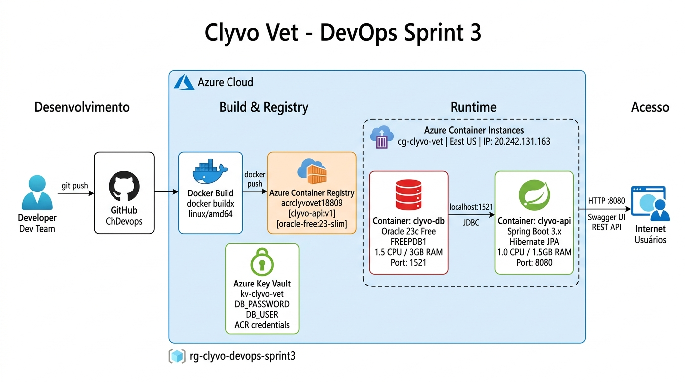
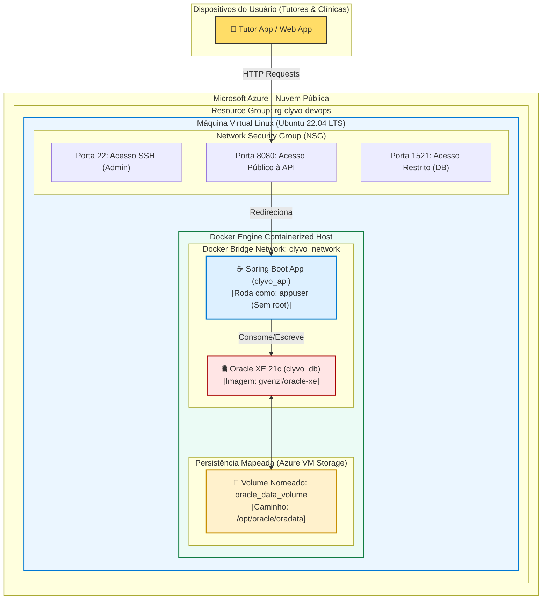
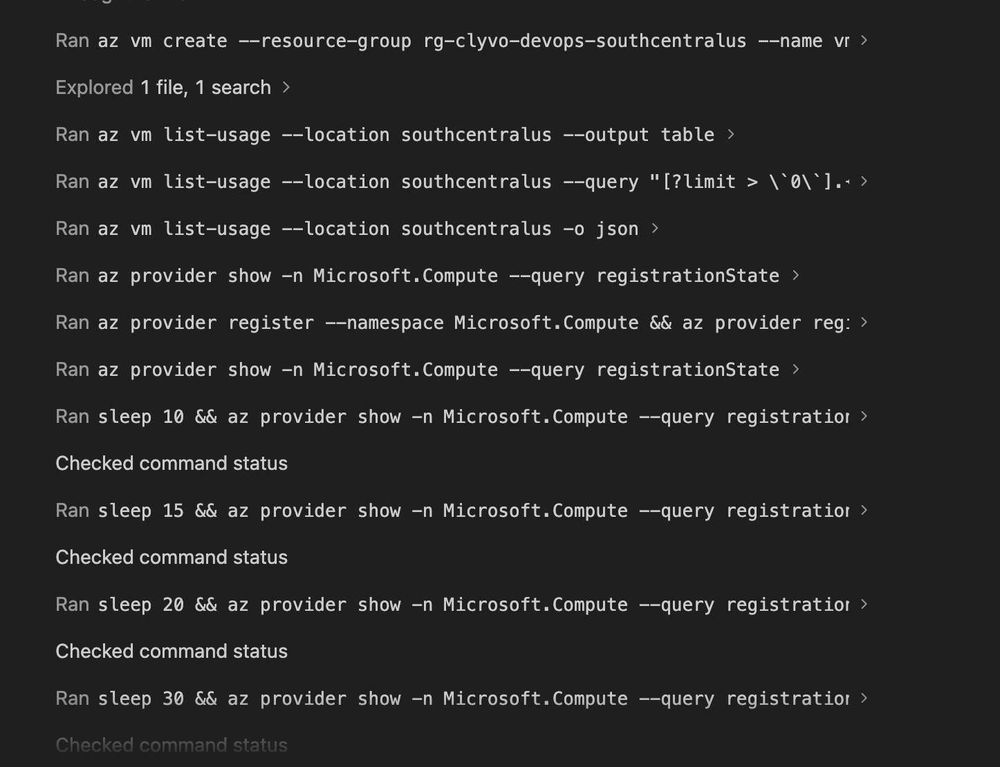
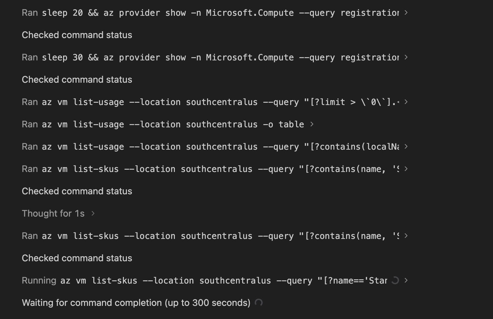
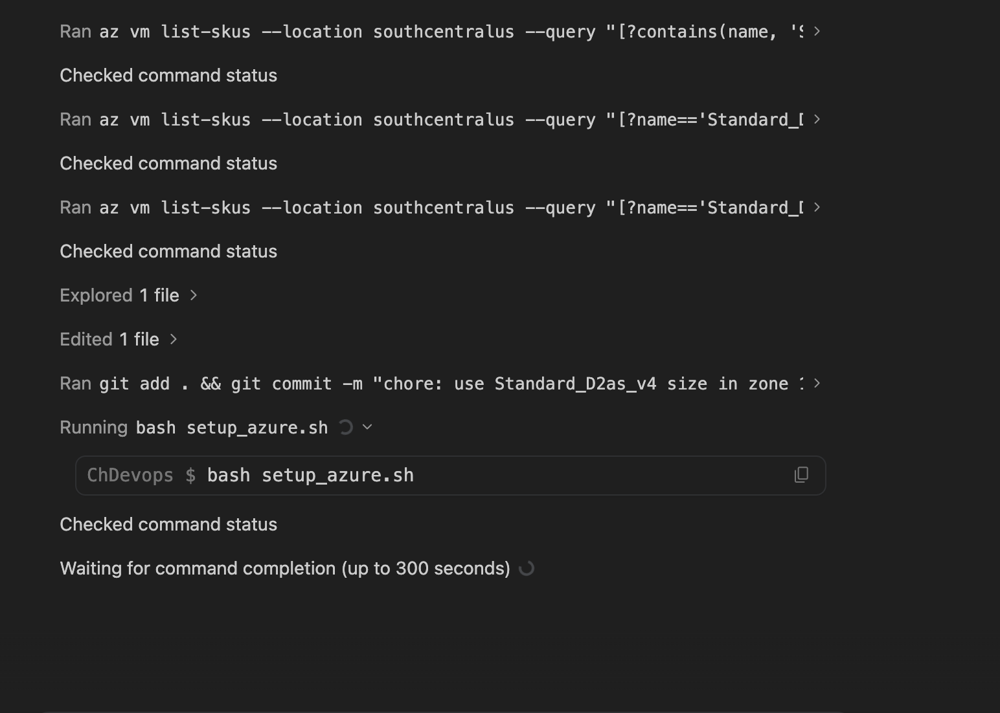
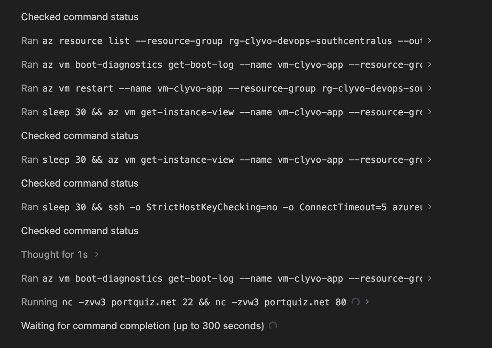
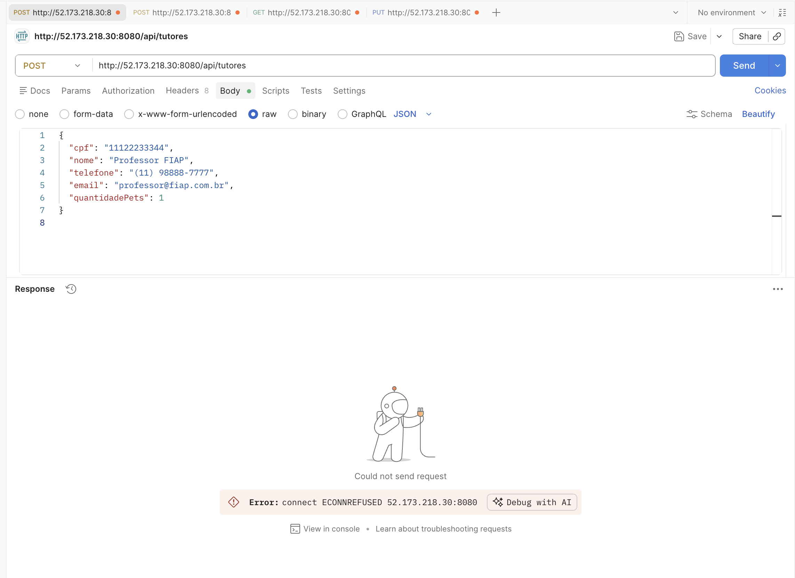
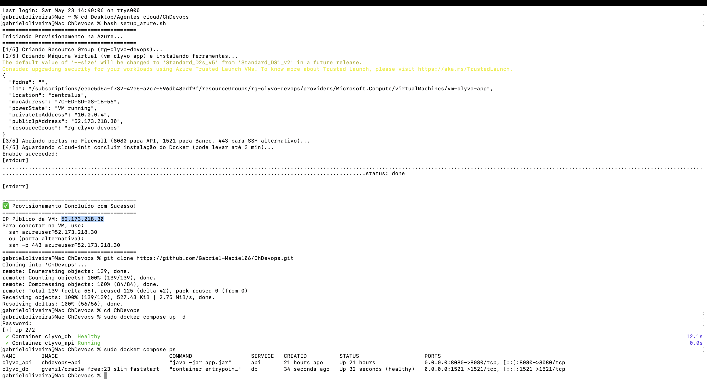
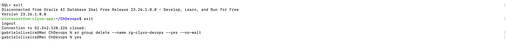
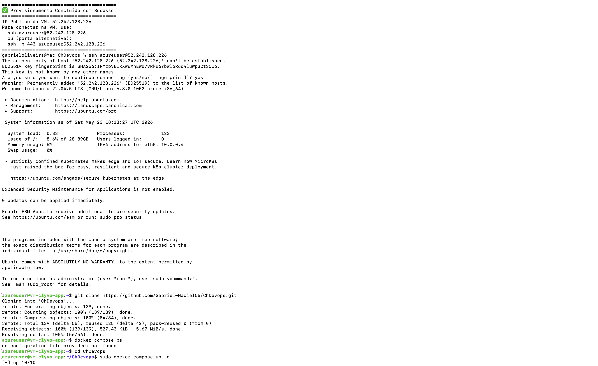

# Clyvo Vet - Enterprise Cloud Architecture & DevOps 🐾☁️

Este repositório contém a entrega oficial do **Sprint 1** para a disciplina de **DevOps Tools & Cloud Computing** (FIAP 2026). O projeto apresenta a infraestrutura conteinerizada e provisionada na nuvem da Microsoft Azure para a solução **Clyvo Vet**, o super app de gestão preditiva e longevidade pet desenvolvido em Java Advanced.

---

## 👥 Integrantes
- **Vitória Rodrigues Martins** - RM565160
- **Augusto Bonomo Júnior** - RM565155
- **Thomas Fontes** - RM562254
- **Gabriel Maciel** - RM562795
- **Matheus Pereira Molina** - RM563399

---

## 🚀 Benefícios para o Negócio (Business Benefits)

A modernização da infraestrutura do Clyvo Vet utilizando **Docker, Docker Compose e Microsoft Azure** traz benefícios estratégicos e tangíveis ao negócio da clínica e dos tutores:

1. **Alta Disponibilidade (High Availability):** O provisionamento em nuvem garante que o sistema de monitoramento preditivo de pets esteja online 24/7, permitindo que tutores acessem alertas críticos a qualquer momento e de qualquer lugar.
2. **Escalabilidade Elástica:** A arquitetura baseada em contêineres permite que a aplicação escale horizontalmente de forma rápida durante horários de pico (ex: campanhas nacionais de vacinação).
3. **Consistência de Ambientes (Immutable Infrastructure):** A conteinerização com Docker elimina o famoso problema "funciona na minha máquina". O mesmo contêiner testado localmente roda de forma idêntica no servidor de produção Azure.
4. **Isolamento de Segurança:** A aplicação executa isolada em sua própria rede interna do Docker (`clyvo_network`) e roda sob um usuário sem privilégios administrativos (`appuser`), minimizando riscos de segurança de invasão no host.
5. **Persistência de Dados Confiável:** A utilização de volumes nomeados garante que o histórico de saúde, dados clínicos e predições não sejam perdidos caso o contêiner do banco seja reiniciado ou atualizado.

---

## 🗺️ Desenho Macro da Arquitetura na Nuvem

Abaixo está o fluxo detalhado da solução implementada na **Microsoft Azure** utilizando **Docker Compose** para isolamento e orquestração local:



### Diagrama Interativo (Mermaid)


---

## 🛠️ Tecnologias Utilizadas na Infraestrutura
*   **Docker & Docker Compose**: Empacotamento, orquestração e gerenciamento de microsserviços.
*   **Microsoft Azure VM (Ubuntu 22.04 LTS)**: Servidor de aplicação em nuvem.
*   **Azure CLI (Command Line Interface)**: Criação da infraestrutura como código (IaC).
*   **Oracle XE 21c**: Banco de dados relacional oficial.
*   **Maven + Eclipse Temurin JDK 21**: Stack de compilação da API.

---

## 🔗 Endpoints Principais (Rotas para Teste do CRUD)

Para validar a integridade e conformidade da persistência do CRUD, você pode utilizar os seguintes endpoints:

| Método | Endpoint | Descrição | Corpo da Requisição (JSON Exemplo) |
| :--- | :--- | :--- | :--- |
| **POST** | `/api/pets` | Cria um novo pet (Gera cabeçalho `Location` com a URI de retorno) | `{"nome": "Rex", "dataNascimento": "2020-05-15", "peso": 12.5}` |
| **GET** | `/api/pets` | Retorna lista paginada de pets | *(Sem Corpo)* |
| **GET** | `/api/pets/{id}` | Busca um pet por ID e calcula **Insights da IA Preditiva** baseados na raça | *(Sem Corpo)* |
| **PUT** | `/api/pets/{id}` | Atualiza os dados cadastrais de um pet | `{"nome": "Rex Silva", "dataNascimento": "2020-05-15", "peso": 13.0}` |
| **DELETE**| `/api/pets/{id}` | Exclui fisicamente o pet do banco de dados | *(Sem Corpo)* |

---

## 📋 Como Instalar e Executar a Solução (How-to)

### Opção A: Execução em Nuvem (Microsoft Azure via Script CLI)

Esta é a opção recomendada e automatizada. Garanta que você tenha o [Azure CLI](https://learn.microsoft.com/en-us/cli/azure/install-azure-cli) instalado e esteja logado (`az login`).

1. **Baixe o arquivo de automação do repositório:**
   ```bash
   curl -O https://raw.githubusercontent.com/Gabriel-Maciel06/ChDevops/main/setup_azure.sh
   chmod +x setup_azure.sh
   ```

2. **Execute o script de provisionamento:**
   ```bash
   ./setup_azure.sh
   ```
   *O script criará o Grupo de Recursos, a VM, liberará os firewalls e instalará o Docker e o Docker Compose de forma silenciosa via cloud-init.*

3. **Conecte-se na VM criada (o IP público será exibido ao final do script):**
   ```bash
   ssh azureuser@<IP_PUBLICO_DA_VM>
   ```

4. **Dentro da VM, clone o repositório e suba os contêineres:**
   ```bash
   git clone https://github.com/Gabriel-Maciel06/ChDevops.git
   cd ChDevops
   
   # Inicie os contêineres em background (Exigência DevOps 2.1)
   sudo docker compose up -d
   ```

5. **Acompanhe a inicialização (Healthcheck):**
   ```bash
   sudo docker compose ps
   ```

### Opção B: Execução Local (Docker Compose)

Caso queira testar a conteinerização localmente:

1. Certifique-se de ter o Docker e Docker Compose instalados em sua máquina.
2. Clone o repositório e navegue até a pasta raiz:
   ```bash
   git clone https://github.com/Gabriel-Maciel06/ChDevops.git
   cd ChDevops
   ```
3. Suba o ambiente completo com um único comando:
   ```bash
   docker compose up -d
   ```
4. A API estará acessível em `http://localhost:8080/swagger-ui.html`

---

## 📸 Evidências de Execução (Prints)

Para comprovar a execução fim a fim da infraestrutura, deploy e testes via Postman, confira as evidências abaixo capturadas durante a implementação:

<details>
<summary>Clique para expandir e ver os prints</summary>










</details>

---

## 📝 Arquivos de Configuração de DevOps

### 1. Dockerfile (`projects/clyvo-api/Dockerfile`)

```dockerfile
# Estágio de Build (Compilação)
FROM maven:3.9-eclipse-temurin-21-alpine AS builder
WORKDIR /app
COPY pom.xml .
RUN mvn dependency:go-offline -B
COPY src ./src
RUN mvn clean package -DskipTests

# Estágio de Execução (Run)
FROM eclipse-temurin:21-jre-alpine
WORKDIR /app

# Criar grupo e usuário sem privilégios (Exigência DevOps 2.2)
RUN addgroup -S appgroup && adduser -S appuser -G appgroup

# Copiar o jar gerado do estágio de build
COPY --from=builder /app/target/*.jar app.jar

# Mudar para o usuário não-root
USER appuser

EXPOSE 8080
ENTRYPOINT ["java", "-jar", "app.jar"]
```

### 2. Docker Compose (`projects/clyvo-api/docker-compose.yml`)

```yaml
version: '3.8'

services:
  db:
    image: gvenzl/oracle-xe:21-slim
    container_name: clyvo_db
    environment:
      - ORACLE_PASSWORD=060205
      - APP_USER=RM562795
      - APP_USER_PASSWORD=060205
    ports:
      - "1521:1521"
    volumes:
      - oracle_data:/opt/oracle/oradata
      - ./db_setup.sql:/container-entrypoint-initdb.d/01_db_setup.sql
      - ./db_dml.sql:/container-entrypoint-initdb.d/02_db_dml.sql
    networks:
      - clyvo_network
    restart: unless-stopped
    healthcheck:
      test: ["CMD", "healthcheck.sh"]
      interval: 10s
      timeout: 5s
      retries: 5

  api:
    build: .
    container_name: clyvo_api
    depends_on:
      db:
        condition: service_healthy
    ports:
      - "8080:8080"
    environment:
      - DB_URL=jdbc:oracle:thin:@db:1521:XE
      - DB_USER=RM562795
      - DB_PASSWORD=060205
    networks:
      - clyvo_network
    restart: unless-stopped

volumes:
  oracle_data:
    name: oracle_data_volume # Exigência DevOps 2.3: Volume nomeado

networks:
  clyvo_network:
    driver: bridge
```

### 3. Script Azure CLI (`setup_azure.sh`)

```bash
#!/bin/bash
RESOURCE_GROUP="rg-clyvo-devops"
LOCATION="eastus"
VM_NAME="vm-clyvo-app"
IMAGE="Ubuntu2204"
ADMIN_USER="azureuser"

az group create --name $RESOURCE_GROUP --location $LOCATION

az vm create \
  --resource-group $RESOURCE_GROUP \
  --name $VM_NAME \
  --image $IMAGE \
  --admin-username $ADMIN_USER \
  --generate-ssh-keys \
  --custom-data cloud-init.txt

az vm open-port --resource-group $RESOURCE_GROUP --name $VM_NAME --port 8080 --priority 1001
az vm open-port --resource-group $RESOURCE_GROUP --name $VM_NAME --port 1521 --priority 1002
```
