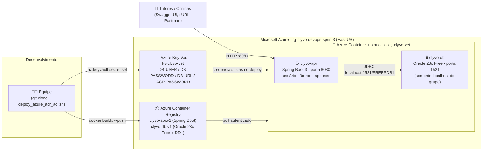

# Clyvo Vet - Plataforma Preditiva de Longevidade Pet 🐾☁️
### Entrega Oficial - 3ª Sprint: DevOps Tools & Cloud Computing (FIAP)
**Opção Escolhida:** **Opção 1 - ACR + ACI (Solução 100% Containerizada: App + Banco de Dados)**

[](https://www.oracle.com/java/)
[](https://spring.io/projects/spring-boot)
[](https://azure.microsoft.com/)
[](https://www.docker.com/)
[](https://www.oracle.com/database/)

---

## 👥 Integrantes do Grupo
- **Vitória Rodrigues Martins** - RM565160
- **Augusto Bonomo Júnior** - RM565155
- **Thomas Fontes** - RM562254
- **Gabriel Maciel** - RM562795
- **Matheus Pereira Molina** - RM563399

---

## 📖 1. Descrição da Solução
O **Clyvo Vet** é uma API REST corporativa (Java 21 + Spring Boot 3) voltada à **medicina veterinária preventiva e à predição de longevidade de pets**.

A plataforma cadastra **tutores** e seus **pets**, cruza a idade cronológica de cada animal com a **predisposição genética da raça** (tabela de apoio `T_RACA`) e gera um **parecer preditivo de longevidade** (`status_longevidade`), com alertas precoces para exames preventivos. O objetivo é agir antes que doenças crônicas se tornem emergências clínicas.

Toda a solução roda na nuvem Microsoft Azure em containers: a API (imagem `clyvo-api`) e o banco Oracle Database 23c Free (imagem `clyvo-db`) ficam no **Azure Container Registry (ACR)** e executam juntos num grupo de containers do **Azure Container Instances (ACI)**.

---

## 💡 2. Benefícios para o Negócio
| Problema | Como a solução resolve |
| :--- | :--- |
| Doenças crônicas descobertas tarde demais | Parecer preditivo por raça e idade gera alertas preventivos, reduzindo custos de emergência e aumentando a longevidade do pet. |
| Clínicas sem histórico centralizado | Tutores e pets ficam num banco relacional único na nuvem, acessível por API a qualquer sistema (app do tutor, clínica, laboratório). |
| Infraestrutura cara e difícil de manter | ACI é serverless: sem VM para administrar, cobrança por segundo de uso e possibilidade de destruir/recriar tudo com um script. |
| Deploy manual e sujeito a erro | 100% dos recursos são criados por **Azure CLI** (Infraestrutura como Código), reproduzíveis em minutos em qualquer conta Azure. |
| Risco de vazamento de credenciais | Senhas ficam no **Azure Key Vault**; nada sensível no código, nas imagens ou no repositório. |
| Superfície de ataque | O container da API roda como usuário **não-root** e a porta do Oracle (1521) **não é exposta** à internet. |

---

## 🗺️ 3. Desenho da Arquitetura (Opção 1: ACR + ACI)




**Fluxo de funcionamento**
1. A equipe clona o repositório e executa `deploy_azure_acr_aci.sh`.
2. O script cria o Resource Group, o Key Vault (guarda usuário/senha do banco) e o ACR.
3. As duas imagens são construídas localmente (`docker buildx`) e enviadas ao ACR: a API e o banco Oracle com o DDL `script_bd.sql` embutido.
4. O script lê as credenciais do Key Vault, gera o YAML do grupo de containers e cria o ACI com dois containers no mesmo host: `clyvo-db` e `clyvo-api`.
5. Na primeira inicialização o Oracle executa `script_bd.sql` (tabelas + comentários) e a carga inicial de raças.
6. A API se conecta ao banco por `localhost:1521` (rede interna do grupo) e fica pública apenas na porta 8080 (Swagger UI e endpoints REST).

---

## 🗄️ 4. Banco de Dados na Nuvem e Tabelas CORE
- **Banco:** Oracle Database 23c Free (imagem `gvenzl/oracle-free:23-slim-faststart`), containerizado no ACI. Sem H2.
- **DDL oficial:** [`script_bd.sql`](script_bd.sql) - tabelas, chaves primárias/estrangeiras e comentários em todas as tabelas e colunas.
- **Carga inicial:** [`db/seed_dados.sql`](db/seed_dados.sql) - popula a tabela de apoio `T_RACA` (3 raças). Os scripts são executados automaticamente na criação do banco por [`db/init_schema.sh`](db/init_schema.sh), embutidos na imagem [`db/Dockerfile`](db/Dockerfile).

### Tabelas CORE (relacionamento 1:N)
| Tabela | Papel | Chave |
| :--- | :--- | :--- |
| **`T_TUTOR`** | Responsável legal pelos pets | PK `cpf` |
| **`T_PET`** | Paciente monitorado (peso, nascimento, parecer preditivo) | PK `id`, FK `tutor_cpf` → `T_TUTOR` (ON DELETE CASCADE), FK `raca_id` → `T_RACA` |

---

## 🔄 5. CRUD Completo nas Duas Tabelas
Documentação interativa: `http://<FQDN>:8080/swagger-ui/index.html`

| Operação | T_TUTOR | T_PET |
| :--- | :--- | :--- |
| **CREATE** | `POST /api/tutores` | `POST /api/pets` |
| **READ** | `GET /api/tutores`, `GET /api/tutores/{cpf}`, `GET /api/tutores/{cpf}/pets` | `GET /api/pets`, `GET /api/pets/{id}` (HATEOAS + insight preditivo) |
| **UPDATE** | `PUT /api/tutores/{cpf}` | `PUT /api/pets/{id}` |
| **DELETE** | `DELETE /api/tutores/{cpf}` | `DELETE /api/pets/{id}` |

Exemplo de payload de pet (o campo `racaId` é opcional e referencia `T_RACA`):
```json
{ "nome": "Thor", "dataNascimento": "2020-04-10", "peso": 34.5, "racaId": 1,
  "tutorCpf": "11122233344", "statusLongevidade": "Fase adulta madura. Monitoramento preventivo semestral." }
```

---

## 🚀 6. Como Fazer o Deploy na Azure (passo a passo)

### 6.1 Pré-requisitos
- [Azure CLI](https://learn.microsoft.com/cli/azure/install-azure-cli) (`az login` feito)
- [Docker](https://docs.docker.com/get-docker/) com `buildx` (Docker Desktop já inclui)
- `envsubst` (pacote `gettext`: `brew install gettext` no macOS / `apt install gettext-base` no Ubuntu)
- `curl` e `python3` (usados pelos scripts de teste)

### 6.2 Deploy (100% Azure CLI)
```bash
# 1. Clone o repositório
git clone https://github.com/Gabriel-Maciel06/ChDevops.git
cd ChDevops

# 2. Defina as credenciais do banco (NUNCA commitadas; vão para o Azure Key Vault)
export DB_USER=clyvo_app
export DB_PASSWORD='SenhaForte#2026'
#    (alternativa: cp .env.example .env e edite o arquivo)

# 3. Execute o deploy completo
chmod +x *.sh
./deploy_azure_acr_aci.sh
```
Ao final o script imprime o **FQDN** e o **IP público**. O Oracle leva de 2 a 5 minutos para inicializar; o script aguarda a API responder.

### 6.3 O que o script executa (Azure CLI)
```bash
# 1. Grupo de recursos
az group create --name rg-clyvo-devops-sprint3 --location eastus

# 2. Key Vault + secrets (usuário e senha do banco nunca ficam no código)
az keyvault create --name kv-clyvo-vet --resource-group rg-clyvo-devops-sprint3 --location eastus --enable-rbac-authorization true
az role assignment create --role "Key Vault Secrets Officer" --assignee <usuario-logado> --scope <id-do-key-vault>
az keyvault secret set --vault-name kv-clyvo-vet --name DB-USER     --value "$DB_USER"
az keyvault secret set --vault-name kv-clyvo-vet --name DB-PASSWORD --value "$DB_PASSWORD"
az keyvault secret set --vault-name kv-clyvo-vet --name DB-URL      --value "jdbc:oracle:thin:@localhost:1521/FREEPDB1"

# 3. Azure Container Registry
az acr create --resource-group rg-clyvo-devops-sprint3 --name acrclyvovet<sufixo> --sku Basic --admin-enabled true
az acr credential show --name acrclyvovet<sufixo>

# 4. Build + push das duas imagens (Docker)
docker login acrclyvovet<sufixo>.azurecr.io -u <usuario-acr> --password-stdin
docker buildx build --platform linux/amd64 -f Dockerfile    -t acrclyvovet<sufixo>.azurecr.io/clyvo-api:v1 --push .
docker buildx build --platform linux/amd64 -f db/Dockerfile -t acrclyvovet<sufixo>.azurecr.io/clyvo-db:v1  --push .

# 5. Azure Container Instances (grupo multi-container: clyvo-db + clyvo-api)
envsubst < azure-aci-multicontainer.template.yaml > azure-aci-deployment.yaml   # injeta credenciais do Key Vault
az container create --resource-group rg-clyvo-devops-sprint3 --file azure-aci-deployment.yaml

# 6. Endereços públicos
az container show -g rg-clyvo-devops-sprint3 -n cg-clyvo-vet --query "ipAddress.{fqdn:fqdn,ip:ip}" -o table
```
O modelo do grupo de containers está em [`azure-aci-multicontainer.template.yaml`](azure-aci-multicontainer.template.yaml) (o arquivo gerado com credenciais é apagado após o deploy e está no `.gitignore`).

### 6.4 Scripts de build e execução das imagens (Docker)
| Arquivo | Função |
| :--- | :--- |
| [`Dockerfile`](Dockerfile) | Imagem da API: multi-stage (Maven → JRE Alpine), usuário **não-root** `appuser`. |
| [`db/Dockerfile`](db/Dockerfile) | Imagem do banco: Oracle 23c Free + `script_bd.sql` + seed executados na criação. |
| [`docker-compose.yml`](docker-compose.yml) | Sobe App + Banco localmente com as mesmas imagens (credenciais via `.env`). |

Comandos equivalentes executados manualmente:
```bash
# build local
docker build -t clyvo-api:v1 .
docker build -f db/Dockerfile -t clyvo-db:v1 .

# tag + push para o ACR
docker tag clyvo-api:v1 <acr>.azurecr.io/clyvo-api:v1 && docker push <acr>.azurecr.io/clyvo-api:v1
docker tag clyvo-db:v1  <acr>.azurecr.io/clyvo-db:v1  && docker push <acr>.azurecr.io/clyvo-db:v1

# execução local (App + Banco) - alternativa ao compose
docker network create clyvo_network
docker run -d --name clyvo_db  --network clyvo_network -p 1521:1521 \
  -e ORACLE_PASSWORD="$DB_PASSWORD" -e APP_USER="$DB_USER" -e APP_USER_PASSWORD="$DB_PASSWORD" clyvo-db:v1
docker run -d --name clyvo_api --network clyvo_network -p 8080:8080 \
  -e DB_URL=jdbc:oracle:thin:@clyvo_db:1521/FREEPDB1 -e DB_USER="$DB_USER" -e DB_PASSWORD="$DB_PASSWORD" clyvo-api:v1

# ou, com compose:
cp .env.example .env   # edite DB_USER / DB_PASSWORD
docker compose up --build -d
```

---

## 🧪 7. Como Testar (App + Banco na nuvem)

### 7.1 Teste automatizado do CRUD (as duas tabelas)
```bash
./testes_crud_core.sh http://<FQDN>:8080
# Para o vídeo: pausa entre as etapas para mostrar o SELECT no banco
PAUSA=1 ./testes_crud_core.sh http://<FQDN>:8080
```
O script executa, em ordem: **CREATE** (2 tutores + 2 pets) → **READ** (listagens e busca por id) → **UPDATE** (pet e tutor) → **DELETE** (pet e tutor) → confirmação **404**.

### 7.2 Evidência direta no banco (SELECT dentro do container Oracle no ACI)
A porta 1521 não é pública; a consulta é feita **dentro** do container via `az container exec`, sem digitar senha:
```bash
./consultar_banco_nuvem.sh "SELECT * FROM T_TUTOR"
./consultar_banco_nuvem.sh "SELECT id, nome, peso, raca_id, tutor_cpf, status_longevidade FROM T_PET"
./consultar_banco_nuvem.sh "SELECT * FROM T_RACA"
./consultar_banco_nuvem.sh            # SQL*Plus interativo
```
Roteiro sugerido para evidenciar cada operação:

| Etapa | Ação na API | SELECT de evidência |
| :--- | :--- | :--- |
| Inserção | `POST /api/tutores` e `POST /api/pets` | `SELECT * FROM T_TUTOR` / `SELECT * FROM T_PET` |
| Consulta | `GET /api/tutores`, `GET /api/pets` | mesmos SELECTs |
| Atualização | `PUT /api/pets/{id}`, `PUT /api/tutores/{cpf}` | `SELECT id, nome, peso, status_longevidade FROM T_PET WHERE id = 1` |
| Exclusão | `DELETE /api/pets/{id}`, `DELETE /api/tutores/{cpf}` | `SELECT COUNT(*) FROM T_PET` / `SELECT * FROM T_TUTOR` |

### 7.3 Testes manuais
- Swagger UI: `http://<FQDN>:8080/swagger-ui/index.html`
- Coleção Postman: [`Postman/ClyvoVet_Collection.json`](Postman/ClyvoVet_Collection.json)
- Logs da API: `az container logs -g rg-clyvo-devops-sprint3 -n cg-clyvo-vet --container-name clyvo-api`

---

## 🔒 8. Segurança
- **Container da API sem privilégios administrativos** (`USER appuser`, item 8.2) - ver [`Dockerfile`](Dockerfile).
- **Sem dados sensíveis no repositório:** `application.properties` lê tudo de variáveis de ambiente, sem valores padrão; `docker-compose.yml` exige `.env` (ignorado pelo git).
- **Azure Key Vault** guarda usuário/senha do banco e senha do ACR; o YAML gerado com credenciais é apagado após o deploy.
- **Porta 1521 não exposta** na internet; API e banco conversam por `localhost` dentro do grupo de containers.
- `spring.jpa.show-sql` desligado em produção.

---

## 🧹 9. Limpeza dos Recursos
```bash
./destroy_azure.sh     # remove o resource group inteiro (ACR, ACI, Key Vault)
```

---

## 📦 10. Entregáveis
- [x] Código-fonte: este repositório.
- [x] DDL comentado: [`script_bd.sql`](script_bd.sql).
- [x] Scripts: `deploy_azure_acr_aci.sh`, `destroy_azure.sh`, `testes_crud_core.sh`, `consultar_banco_nuvem.sh`, `Dockerfile`, `db/Dockerfile`, `docker-compose.yml`, `azure-aci-multicontainer.template.yaml`.
- [x] Desenho da arquitetura: `clyvo_devops_architecture.png` (seção 3).
- [x] Roteiro do vídeo: [`ROTEIRO_GRAVACAO_DEVOPS_SPRINT3.md`](ROTEIRO_GRAVACAO_DEVOPS_SPRINT3.md).
- [x] PDF com nomes, RMs e links: `Entrega_DevOps_Sprint3_FIAP.pdf`.
